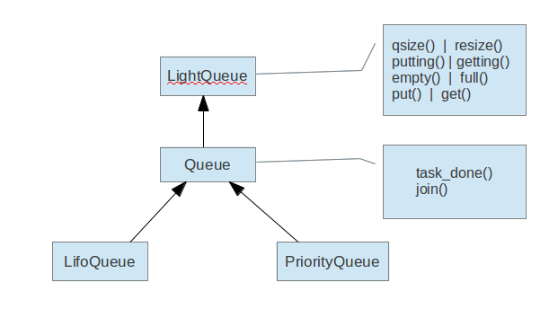

激励自己的话：


站在nova的源码面前，不知该从何处开始，木有资料，木有人指导，只能自己去摸索。nova中，除了mysql是我以前就熟知的之外，其它全是陌生，这对我来说，真是一个不小的挑战。另外，就是看英文文档，就好像干嚼馒头一样，嚼得久了，才会觉得它甜，这也实在是没有办法。

登山的乐趣不在于到达山顶，而在于到达山顶的过程中，在此记录这个过程，希望我可以走到最后！
    


申明：


这里所写的，只是我对自己学习过程的一个记录，而且只是一个初步的学习，其中难免会有理解不到位，或者是有错误的地方，如果有高人飘过，还请不吝赐教。


正文：


万事开头难啊，翻看了nova的源码，只有一个感觉：完全看不懂！在官网上也没有找到关于在源代码层面上的架构图，只有几个组件之间的关系的高层结构图，这又增加了一个难度，好在网上还流传了一份"Hacking on Nova"，对nova的源码结构有一个大概的介绍，也有一定的帮助。但是，这对从0起步的新手来说，还是过于高层，因为源码中用到了很多第三方的包，如果对这些包不熟悉的话，那是寸步难行啊！所以我决定从这些包开始学习，其中之一，就是今天的主题：eventlet，因为这个包在很多地方都用到了，深入了解了eventlet之后，发现这绝对是进入nova世界的关键，因为它涉及一个很重要的概念，就是“协程(coroutines)”。

这是eventlet的官方网站：http://eventlet.net/


#### 1. 首先说一下什么是协程

协同程序与线程差不多，也就是一条执行序列，拥有自己独立的栈，局部变量和指令指针，同时又与其它协同程序共享全局变量和其它大部分东西。线程与协同程序的主要区别在于，一个具有多线程的程序可以同时运行几个线程，而协同程序却需要彼此协作地运行。就是说，一个具有多个协同程序的程序在任何时刻只能运行一个协同程序，并且正在运行的协同程序只会在其显示地挂起时，它的执行才会暂停。


#### 2. 协程有什么好处呢？

- 每个coroutine有自己私有的stack及局部变量。

- 同一时间只有一个coroutine在执行，无需对全局变量加锁。

- 顺序可控，完全由程序控制执行的顺序。而通常的多线程一旦启动，它的运行时序是没法预测的，因此通常会给测试所有的情况带来困难。所以能用coroutine解决的场合应当优先使用coroutine。


#### 3. eventlet是什么，它用来做什么的？

这是我现阶段的理解：eventlet是一个用来处理和网络相关的python库函数，而且可以通过协程来实现并发，在eventlet里，把“协程”叫做greenthread(绿色线程)。所谓并发，就是开启了多个greenthread，并且对这些greenthread进行管理，以实现非阻塞式的I/O。比如说用eventlet可以很方便的写一个性能很好的web服务器，或者是一个效率很高的网页爬虫，这都归功于eventlet的“绿色线程”，以及对“绿色线程”的管理机制。更让人不可思议的是，eventlet为了实现“绿色线程”，竟然对python的和网络相关的几个标准库函数进行了改写，并且可以以补丁（patch）的方式导入到程序中，因为python的库函数只支持普通的线程，而不支持协程，eventlet称之为“绿化”。


#### 4. 几个主要API的理解

    这里可以直接看源码，因为官方的文档也是从源码中的注释得来的。
    


##### 4.1. Greenthread Spawn（spawn，孵化的意思，即如何产生greenthread）

  主要有3个函数可以创建绿色线程：

  1. spawn(func, *args, **kwargs)：

        创建一个绿色线程去运行func这个函数，后面的参数是传递给这个函数的参数。返回值是一个eventlet.GreenThread对象，这个对象可以用来接受func函数运行的返回值。在绿色线程池还没有满的情况下，这个绿色线程一被创建就立刻被执行。其实，用这种方法去创建线程也是可以理解的，线程被创建出来，肯定是有一定的任务要去执行，这里直接把函数当作参数传递进去，去执行一定的任务，就好像标准库中的线程用run()方法去执行任务一样。

  2. spawn_n(func, *args, **kwargs)：

        这个函数和spawn()类似，不同的就是它没有返回值，因而更加高效，这种特性，使它也有存在的价值。

  3. spawn_after(seconds, func, *args, **kwargs)

        这个函数和spawn()基本上一样，都有一样的返回值，不同的是它可以限定在什么时候执行这个绿色线程，即在seconds秒之后，启动这个绿色线程。


##### 4.2. Greenthread Control

1. sleep(seconds=0)

        中止当前的绿色线程，以允许其它的绿色线程执行。

2. eventlet.GreenPool

    这是一个类，在这个类中用set集合来容纳所创建的绿色线程，并且可以指定容纳线程的最大数量（默认是1000个），它的内部是用Semaphore和Event这两个类来对池进行控制的，这样就构成了线程池。其中，有几个比较重要的方法：
    
        running(self)：返回当前池中的绿色线程数

        free()：返回当前池中仍可容纳的绿色线程数

        spawn()、spawn_n()：创建新的绿色线程

        starmap(self, function, iterable)
        imap(self, function, *iterables)
    

        这两个函数和标准的库函数中的这两个函数实现的功能是一样的，
        所不同的是这里将这两个函数的执行放到了绿色线程中。
        前者实现的是从iterable中取出每一项作为function的参数来执行，
        后者则是分别从iterables中各取一项，作为function的参数去执行。
    
        如：imap(pow, (2,3,10), (5,2,3)) --> 32 9 1000


3. eventlet.GreenPile

    这也是一个类，而且是一个很有用的类，在它内部维护了一个GreenPool对象和一个Queue对象。
    这个GreenPool对象可以是从外部传递进来的，也可以是在类内部创建的，GreenPool对象主要是用来创建绿色线程的，即在GreenPile内部调用了GreenPool.spawn()方法。而Queue对象则是用来保存spawn()方法的返回值的，即Queue中保存的是GreenThread对象。并且它还实现了next()方法，也就意味着GreenPile对象具有了迭代器的性质。所以如果我们要对绿色线程的返回值进行操作的话，用这个类是再好不过的了。

4. eventlet.Queue

    说到队列就不得不画个类图了，基类是LightQueue，它实现了大部分的队列的常用方法。它是用collections做为实现队列的基本数据结构的。而且这个LightQueue的实现，不单单实现了存取操作，我觉得在本质上它实现了一个生产者和消费者问题，定义了两个set()类型的成员变量putters和getters，前者用来存放在队列满时，被阻塞的绿色线程，后者用来存放当队列空时，被阻塞的绿色线程。类中的putting()和getting()方法就是分别得到被阻塞的绿色线程的数量。

    Queue继承了LightQueue，并且又增加了它自己的两个方法：task_done()和join()。task_done()是被消费者的绿色线程所调用的，表示在这个项上的所有工作都做完了，join()是阻塞，直到队列中所有的任务都完成。LifoQueue和PriorityQueue是存放数据的两种不同的方式。
        
        
        


##### 4.3. Patching Functions（补丁方法）

这里就是之前所说的“绿化”，经过eventlet“绿化”过的模块都在eventlet.green中，导入他们主要有两种方法：

1.  from eventlet.green import ...  + 

    import_patched(module_name,*additional_modules,**kw_additional_modules)，如：
      
      ```
      
      from eventlet.green import socket  
      from eventlet.green import SocketServer  
      BaseHTTPServer = eventlet.import_patched('BaseHTTPServer',  
                                ('socket', socket),  
                                ('SocketServer', SocketServer))  
      BaseHTTPServer = eventlet.import_patched('BaseHTTPServer',  
                                socket=socket, SocketServer=SocketServer) 
      ```
      
    这种方法有个缺陷就是不支持“延迟绑定”(late binding)，比如在运行时导入模块。
    
    
    
2. monkey_patch(all=True,os=None, select=None, socket=None,thread=None,time=None,psycopg=None)，如：

```

import eventlet  
eventlet.monkey_patch(socket=True, select=True) 
```
不知道老外是怎么想的，竟然叫做monkey，这个monkey是作何解呢？可能是因为它导入模块是零星导入的吧，就好像猴挠一样。这种方法就没有上面所说的那个“延迟绑定”的缺陷，想什么时候导入就什么时候导入，just like monkey !


##### 4.4. Network Convenience Functions（和网络相关的函数）

这些函数定义在convenience.py文件中，对和socket相关的网络通信进行了包装，注意，这里用的socket是经过修改后的socket，以使它使用绿色线程，主要有以下一个函数：

1. connect(addr, family=socket.AF_INET, bind=None)

    主要执行了以下几个步骤：新建了一个TCP类型的socket，绑定本地的ip和端口，和远程的地址进行连接，源码如下：


```
def connect(addr, family=socket.AF_INET, bind=None):  
    sock = socket.socket(family, socket.SOCK_STREAM)  
    if bind is not None:  
        sock.bind(bind)  
    sock.connect(addr)  
    return sock  

```

2. listen(addr, family=socket.AF_INET, backlog=50)
 
    过程和connect()类似，只是把connect()换成了listen()，backlog指定了最大的连接数量，源码如下：

```
def listen(addr, family=socket.AF_INET, backlog=50):  
    sock = socket.socket(family, socket.SOCK_STREAM)  
    if sys.platform[:3]=="win":  
        sock.setsockopt(socket.SOL_SOCKET, socket.SO_REUSEADDR, 1)  #这段不知道具体是做什么的  
    sock.bind(addr)  
    sock.listen(backlog)  
    return sock  

```

3. serve(sock, handle, concurrency=1000)
    
    这个函数直接创建了一个socket服务器，在它内部创建了一个GreenPool对象，默认的最大绿色线程数是1000，然后是一个循环来接受连接，源码如下：

```
def serve(sock, handle, concurrency=1000):  
    pool = greenpool.GreenPool(concurrency)  
    server_gt = greenthread.getcurrent()  
   
    while True:  
        try:  
            conn, addr = sock.accept()  
            gt = pool.spawn(handle, conn, addr)  
            gt.link(_stop_checker, server_gt, conn)  
            conn, addr, gt = None, None, None  
        except StopServe:  
            return  
```

4. wrap_ssl(sock, *a, **kw)
    
    给socket加上ssl(安全套接层)，对数据进行加密。


还有几个比较重要的API这里就不罗列了，等以后用到了再进行分析吧，下面看几个官方的例子：


##### 4.5. 举例：

有了上面的基础知识，官方的例子就比较容易理解了。

1. 官方上引以为傲的“网页爬虫”，用到了绿色线程池和imap()函数


```

urls = ["http://www.google.com/intl/en_ALL/images/logo.gif",  
     "https://wiki.secondlife.com/w/images/secondlife.jpg",  
     "http://us.i1.yimg.com/us.yimg.com/i/ww/beta/y3.gif"]  
  
import eventlet  
from eventlet.green import urllib2    
  
def fetch(url):  
  print "opening", url  
  body = urllib2.urlopen(url).read()  
  print "done with", url  
  return url, body  
  
pool = eventlet.GreenPool(200)  
for url, body in pool.imap(fetch, urls):  
  print "got body from", url, "of length", len(body)  
```


2. socket服务器


```
import eventlet  
  
def handle(fd):  
    print "client connected"  
    while True:  
        # pass through every non-eof line  
        x = fd.readline()  
        if not x: break  
        fd.write(x)  
        fd.flush()  
        print "echoed", x,  
    print "client disconnected"  
  
print "server socket listening on port 6000"  
server = eventlet.listen(('0.0.0.0', 6000))  
pool = eventlet.GreenPool()  
while True:  
    try:  
        new_sock, address = server.accept()  
        print "accepted", address  
        pool.spawn_n(handle, new_sock.makefile('rw'))  
    except (SystemExit, KeyboardInterrupt):  
        break  

```

3. 使用GreenPile的例子


```
import eventlet  
from eventlet.green import socket  
  
def geturl(url):  
    c = socket.socket()  
    ip = socket.gethostbyname(url)  
    c.connect((ip, 80))  
    print '%s connected' % url  
    c.sendall('GET /\r\n\r\n')  
    return c.recv(1024)  
  
urls = ['www.google.com', 'www.yandex.ru', 'www.python.org']  
pile = eventlet.GreenPile()  
for x in urls:  
    pile.spawn(geturl, x)  
  
# note that the pile acts as a collection of return values from the functions  
# if any exceptions are raised by the function they'll get raised here  
for url, result in zip(urls, pile):  
    print '%s: %s' % (url, repr(result)[:50])  

```

##### 4.6. 参考资料：

- http://eventlet.net/doc/index.html

- http://docs.python.org/library/itertools.html

- http://timyang.net/lua/lua-coroutine/